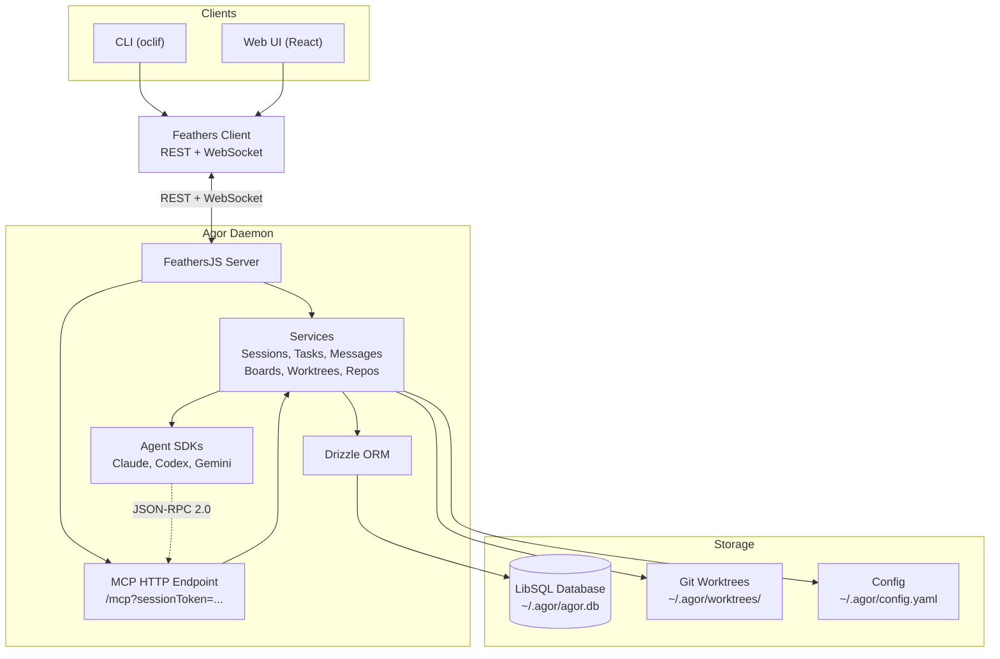

# Agor

**Think Figma, but for AI coding assistants.** Orchestrate Claude Code, Codex, and Gemini sessions on a multiplayer canvas. Manage git worktrees, track AI conversations, and visualize your team's agentic work in real-time.

> **TL;DR:** Agor is a multiplayer spatial canvas where you coordinate multiple AI coding assistants on parallel tasks, with GitHub-linked worktrees, automated workflow zones, and isolated test environments—all running simultaneously.

**📖 [Read the full documentation at agor.live →](https://agor.live/)**

---

## See It In Action

<div align="center">
  <table>
    <tr>
      <td width="50%">
        
        <p align="center"><em style="opacity: 0.5;">Spatial canvas with worktrees and zones</em></p>
      </td>
      <td width="50%">
        
        <p align="center"><em style="opacity: 0.5;">Rich web UI for AI conversations</em></p>
      </td>
    </tr>
    <tr>
      <td width="50%">
        
        <p align="center"><em style="opacity: 0.5;">MCP servers and worktree management</em></p>
      </td>
      <td width="50%">
        
        <p align="center"><em style="opacity: 0.5;">Live collaboration with cursors and comments</em></p>
      </td>
    </tr>
  </table>
</div>

**[→ Watch unscripted demo on YouTube](https://www.youtube.com/watch?v=qiYHw20zjzE)** (13 minutes)

---

<div align="center">
  <h3>✨ Pledge ✨</h3>
  <p><strong>⭐️ I pledge to fix a GitHub issue for every star Agor gets :)</strong></p>
</div>

---

## Installation

### Requirements

- **Node.js** 20.x
- **Zellij** ≥ 0.40 (required - daemon will not start without it)

Install Zellij:

```bash
# Ubuntu/Debian
curl -L https://github.com/zellij-org/zellij/releases/latest/download/zellij-x86_64-unknown-linux-musl.tar.gz | sudo tar -xz -C /usr/local/bin

# macOS
brew install zellij

# RHEL/CentOS
curl -L https://github.com/zellij-org/zellij/releases/latest/download/zellij-x86_64-unknown-linux-musl.tar.gz | sudo tar -xz -C /usr/local/bin
```

### Install Agor

```bash
npm install -g agor-live
```

**Note:** Agor requires Zellij for persistent terminal sessions. The daemon will fail to start with a helpful error message if Zellij is not installed.

## Quick Start

```bash
# 1. Initialize (creates ~/.agor/ and database)
agor init

# 2. Start the daemon
agor daemon start

# 3. Open the UI
agor open
```

**Try in Codespaces:**

[](https://github.com/codespaces/new?skip_quickstart=true&machine=basicLinux32gb&repo=1069864589&ref=main&devcontainer_path=.devcontainer%2Fdevcontainer.json&geo=UsWest)

---

## Key Features

### 🧩 Agent Swarm Control

- Run as many **Claude Code**, **Codex**, and **Gemini** sessions as you can handle—simultaneously.
- Agents in Agor can coordinate and supervise through the internal Agor MCP service.
- Built-in **scheduler** triggers templated prompts on your cadence.

### 🌐 Multiplayer Spatial Canvas

- Figma-esque board layout organizes your AI coding sessions across boards (full 2D canvases).
- **Scoped/spatial comments** + reactions pinned to boards, zones, or worktrees (Figma-style).
- WebSocket-powered cursor broadcasting and facepiles show teammates in real time.

### 🌲 Session Trees — Fork, Spawn, Coordinate

- **Fork sessions** to explore alternatives without losing the original path.
- **Spawn subsessions** for focused subtasks that report back to the parent.
- Visualize the session genealogy in "session trees"

### ⚙️ Zone Triggers — Workflows Made Spatial

- Define **zones** on your board that trigger templated prompts when worktrees are dropped.
- Build **kanban-style flows** or custom pipelines: analyze → develop → review → deploy.
- **GitHub-native workflow**: Link worktrees to issues/PRs, auto-inject context into prompts
  - Template syntax: `"deeply analyze this github issue: {{ worktree.issue_url }}"`
  - Each worktree = isolated branch for a specific issue/PR
  - AI agents automatically read the linked issue/PR context

### 🌳 Isolated Development Environments

**The Problem:** Working on 3 PRs simultaneously? Each needs different ports, dependencies, database states.

**Agor's Solution:**

- Each worktree gets its own **isolated environment** with auto-managed unique ports
- Configure start/stop commands once with templates: `PORT={{ add 9000 worktree.unique_id }} docker compose up -d`
- Everyone on your team can **one-click start/stop** any worktree's environment
- Multiple AI agents work in parallel without stepping on each other
- Health monitoring tracks if services are running properly

**No more:** "Kill your local server, I need to test my branch"

### 🕹️ Real-Time Strategy for AI Teams

- Coordinate agentic work like a multiplayer RTS.
- Watch teammates or agents move across tasks live.
- Cluster sessions, delegate, pivot, and iterate together.

### 📱 Mobile-Friendly Prompting

- **Keep sessions cooking on the go** — mobile-optimized UI for sending prompts and monitoring progress.
- Access conversations, send follow-ups, and check agent status from your phone.
- Full conversation view with hamburger navigation to switch between sessions.

---

## Use Case: Parallel PR Workflow

Your team has 3 bug fixes and 2 features in flight. With Agor:

1. **Create 5 worktrees**, each linked to its GitHub issue/PR
2. **Spawn AI sessions** for each worktree (Claude, Codex, Gemini)
3. **Drop into zones** → "Analyze" zone triggers: `"Review this issue: {{ worktree.issue_url }}"`
4. **Watch in real-time** as all 5 agents work simultaneously on the spatial canvas
5. **Isolated environments** with unique ports prevent conflicts
6. **Push directly** from worktrees to GitHub when ready

**No context switching. No port collisions. No waiting.**

---

## Screenshots

<div align="center">
  
  <p style="opacity: 0.5;"><em>Multiplayer spatial canvas with zones, worktrees, and real-time collaboration</em></p>
</div>

<div align="center">
  <table>
    <tr>
      <td width="50%">
        
        <p align="center"><em style="opacity: 0.5;">Task-centric conversation UI</em></p>
      </td>
      <td width="50%">
        
        <p align="center"><em style="opacity: 0.5;">MCP server and worktree management</em></p>
      </td>
    </tr>
    <tr>
      <td width="50%">
        
        <p align="center"><em style="opacity: 0.5;">Zone trigger modal on session drop</em></p>
      </td>
      <td width="50%">
        
        <p align="center"><em style="opacity: 0.5;">Zone trigger configuration</em></p>
      </td>
    </tr>
    <tr>
      <td width="50%">
        
        <p align="center"><em style="opacity: 0.5;">Worktree environment setup</em></p>
      </td>
      <td width="50%">
        
        <p align="center"><em style="opacity: 0.5;">Session creation with agent selection</em></p>
      </td>
    </tr>
    <tr>
      <td width="50%">
        
        <p align="center"><em style="opacity: 0.5;">Built-in terminal with worktree context</em></p>
      </td>
      <td width="50%">
        
        <p align="center"><em style="opacity: 0.5;">Welcome screen showing team status</em></p>
      </td>
    </tr>
  </table>
</div>

---

## Architecture



**[Full Architecture Guide →](https://agor.live/guide/architecture)**

---

## Development

**[Development Guide →](https://agor.live/guide/development)**

Quick start (localhost):

```bash
# Terminal 1: Daemon
cd apps/agor-daemon && pnpm dev  # :3030

# Terminal 2: UI
cd apps/agor-ui && pnpm dev      # :5173
```

Or use Docker:

```bash
docker compose up
```

---

## Roadmap

**[View roadmap on GitHub →](https://github.com/preset-io/agor/issues?q=is%3Aissue+state%3Aopen+label%3Aroadmap)**

Highlights:

- **Match CLI-Native Features** — SDKs are evolving rapidly and exposing more functionality. Push integrations deeper to match all key features available in the underlying CLIs
- **Bring Your Own IDE** — Connect VSCode, Cursor, or any IDE directly to Agor-managed worktrees via SSH/Remote
- **Unix User Integration** — Enable true multi-tenancy with per-user Unix isolation for secure collaboration. [Read the exploration →](https://github.com/preset-io/agor/blob/main/context/explorations/unix-user-integration.md)

---

## Community

- **[Discord](https://discord.gg/HZKWXfgc)** - Join our Discord community for support and discussion
- **[GitHub Discussions](https://github.com/preset-io/agor/discussions)** - Ask questions, share ideas
- **[GitHub Issues](https://github.com/preset-io/agor/issues)** - Report bugs, request features

---

## About

**Heavily prompted by [@mistercrunch](https://github.com/mistercrunch)** ([Preset](https://preset.io), [Apache Superset](https://github.com/apache/superset), [Apache Airflow](https://github.com/apache/airflow)), built by an army of Claudes.

Read the story: [Making of Agor →](https://agor.live/blog/making-of-agor)
