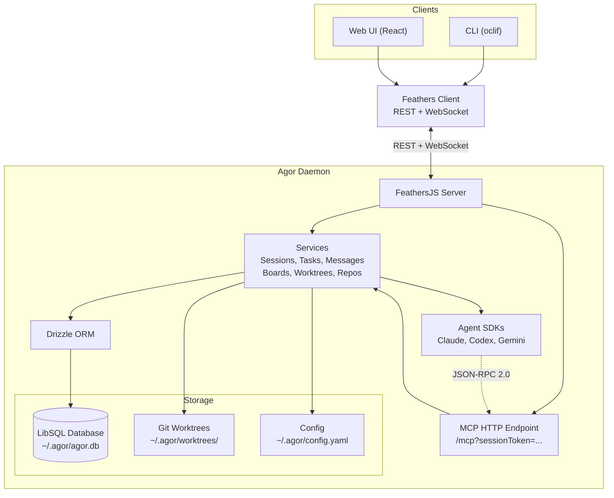

# Agor

Orchestrate Claude Code, Codex, and Gemini sessions on a multiplayer canvas. Manage git worktrees, track AI conversations, and visualize your team's agentic work in real-time.

**[Docs](https://mistercrunch.github.io/agor/)** | **[Discussions](https://github.com/mistercrunch/agor/discussions)**

---

## Installation

```bash
npm install -g agor-live
```

## Quick Start

```bash
# 1. Initialize (creates ~/.agor/ and database)
agor init

# 2. Start the daemon
agor daemon start

# 3. Open the UI
agor open
```

**Try in Codespaces:**

[](https://codespaces.new/mistercrunch/agor?quickstart=1&devcontainer_path=.devcontainer%2Fplayground%2Fdevcontainer.json)

---

## See It In Action

<div align="center">
  <table>
    <tr>
      <td width="50%">
        
        <p align="center"><em style="opacity: 0.5;">Spatial canvas with worktrees and zones</em></p>
      </td>
      <td width="50%">
        
        <p align="center"><em style="opacity: 0.5;">Rich web UI for AI conversations</em></p>
      </td>
    </tr>
    <tr>
      <td width="50%">
        
        <p align="center"><em style="opacity: 0.5;">MCP servers and worktree management</em></p>
      </td>
      <td width="50%">
        
        <p align="center"><em style="opacity: 0.5;">Live collaboration with cursors and comments</em></p>
      </td>
    </tr>
  </table>
</div>

**[→ Watch unscripted demo on YouTube](https://www.youtube.com/watch?v=qiYHw20zjzE)** (13 minutes)

---

## Key Features

### 🧩 Agent Orchestration Layer

- **Claude Code**, **Codex**, and **Gemini** support via extensible SDK — more coming soon.
- Centralized **MCP configuration** — connect once, use across all tools.
- Swap or parallelize agents with one command; easily hand off work when one model stalls.

### 🌐 Multiplayer Spatial Canvas

- Real-time collaboration with **cursor broadcasting** and **facepiles**.
- Sessions live on a **dynamic board** — cluster by project, phase, or purpose.
- **Threaded comments** directly on the board with spatial pins (Figma-style).
- **Emoji reactions** for quick feedback; resolve threads when decisions are made.

### 🌲 Session Trees — Fork, Spawn, Coordinate

- **Fork sessions** to explore alternatives without losing the original path.
- **Spawn subsessions** for focused subtasks that report back to the parent.
- Visualize the full genealogy — see how work branched, merged, and evolved.
- Track outcomes across the tree to understand what approaches worked.

### ⚙️ Zone Triggers — Workflows Made Spatial

- Define **zones** on your board that trigger templated prompts when sessions are dropped.
- Build **kanban-style flows** or custom pipelines: analyze → develop → review → deploy.
- Combine with context templates to automate arbitrarily complex workflows.

### 🌳 Shared, Persisted Dev Environments

- **No more local environment juggling** — managed **git worktrees** with shared, persistent dev environments.
- Sessions map to worktrees with running apps, auto-managed ports, and health monitoring.
- **One-click control** — configure start/stop commands once, everyone on the team can use it.
- Works with any stack: `docker compose up`, `npm run dev`, `./manage.py runserver`.

### 🕹️ Real-Time Strategy for AI Teams

- Coordinate agentic work like a multiplayer RTS.
- Watch teammates or agents move across tasks live.
- Cluster sessions, delegate, pivot, and iterate together.

---

## Screenshots

<div align="center">
  
  <p style="opacity: 0.5;"><em>Multiplayer spatial canvas with zones, worktrees, and real-time collaboration</em></p>
</div>

<div align="center">
  <table>
    <tr>
      <td width="50%">
        
        <p align="center"><em style="opacity: 0.5;">Task-centric conversation UI</em></p>
      </td>
      <td width="50%">
        
        <p align="center"><em style="opacity: 0.5;">MCP server and worktree management</em></p>
      </td>
    </tr>
    <tr>
      <td width="50%">
        
        <p align="center"><em style="opacity: 0.5;">Zone trigger modal on session drop</em></p>
      </td>
      <td width="50%">
        
        <p align="center"><em style="opacity: 0.5;">Zone trigger configuration</em></p>
      </td>
    </tr>
    <tr>
      <td width="50%">
        
        <p align="center"><em style="opacity: 0.5;">Worktree environment setup</em></p>
      </td>
      <td width="50%">
        
        <p align="center"><em style="opacity: 0.5;">Session creation with agent selection</em></p>
      </td>
    </tr>
    <tr>
      <td width="50%">
        
        <p align="center"><em style="opacity: 0.5;">Built-in terminal with worktree context</em></p>
      </td>
      <td width="50%">
        
        <p align="center"><em style="opacity: 0.5;">Welcome screen showing team status</em></p>
      </td>
    </tr>
  </table>
</div>

---

## Architecture



**[Full Architecture Guide →](https://mistercrunch.github.io/agor/guide/architecture)**

---

## Development

**[Development Guide →](https://mistercrunch.github.io/agor/guide/development)**

Quick start:

```bash
# Terminal 1: Daemon
cd apps/agor-daemon && pnpm dev  # :3030

# Terminal 2: UI
cd apps/agor-ui && pnpm dev      # :5173
```

---

## Roadmap

**[View roadmap on GitHub →](https://github.com/mistercrunch/agor/issues?q=is%3Aissue+state%3Aopen+label%3Aroadmap)**

Highlights:

- **Match CLI-Native Features** — SDKs are evolving rapidly and exposing more functionality. Push integrations deeper to match all key features available in the underlying CLIs
- **Bring Your Own IDE** — Connect VSCode, Cursor, or any IDE directly to Agor-managed worktrees via SSH/Remote
- **Session Forking UI** — Visual genealogy showing how work branched, merged, and evolved
- **Automated Reports** — AI-generated summaries after task completion capturing outcomes and decisions
- **Context Management System** — Modular markdown-based context files that compose into session-specific knowledge
