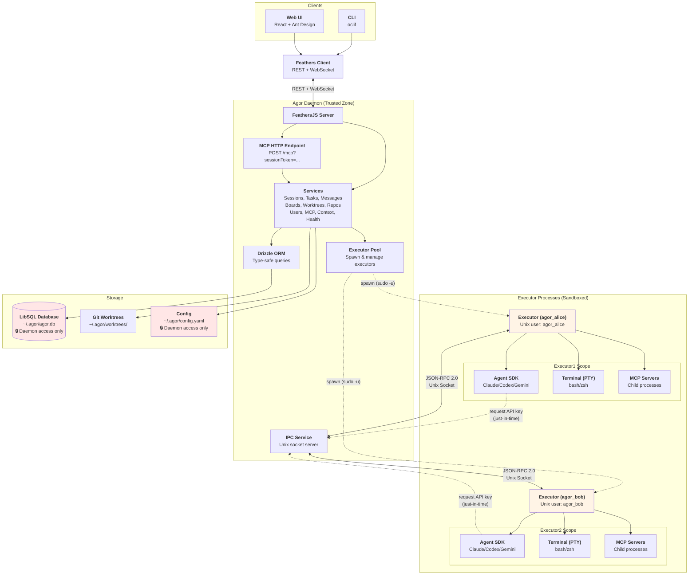
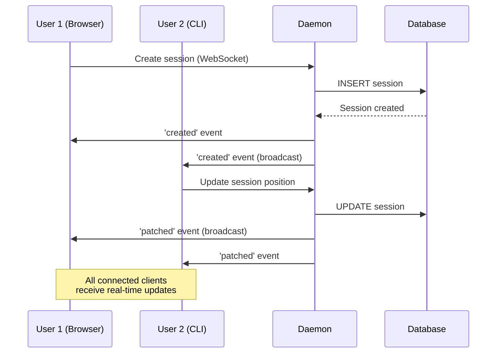

# Architecture Overview

Agor is a **multi-client agent orchestration platform** with real-time collaboration, built on a local-first daemon architecture.

## System Architecture

### Current Architecture (Executor Isolation)

Agor uses the **Executor Isolation** model, which separates privileged daemon operations from untrusted SDK/CLI execution contexts for enhanced security. The executor runs as a specialized subprocess that communicates with the daemon via session token authentication.



**Key Security Improvements:**

- **Process Separation** - Executors run as separate processes with different Unix users
- **Session Token Authentication** - Executors authenticate with daemon using opaque UUID tokens (not JWTs), validated by custom Feathers strategy
- **Feathers Client Communication** - Executors use authenticated Feathers client for all database/service operations (no direct database access)
- **No Database Access** - Executors never receive database credentials or direct database connections
- **Just-in-Time API Keys** - Executors request API keys per-call via IPC (not in environment)
- **Unix User Isolation** - Each executor runs as `agor_alice`, `agor_bob`, etc. (file permission boundaries)
- **IPC Audit Trail** - All daemon↔executor communication logged
- **Credential Isolation** - SSH keys, GitHub tokens isolated by Unix user (`~/.ssh/` ownership)

**Implementation Details:**

- All Agent SDKs (Claude, Codex, Gemini) run exclusively in executor processes
- Executor uses `@agor/core/api` Feathers client with session token authentication
- Custom `SessionTokenStrategy` in daemon validates tokens via `SessionTokenService`
- Session tokens are opaque UUIDs (not JWTs) with 24-hour expiration
- IPC communication via Unix sockets using JSON-RPC 2.0 protocol
- Daemon routes all SDK operations through ExecutorPool service

For detailed design documentation, see `context/explorations/executor-isolation.md`.

### Legacy Architecture (Unified Process Model)

Prior to executor isolation, Agor ran all SDK operations directly within the daemon process. This simplified architecture had Agent SDKs as direct dependencies of the daemon, with tools executing in the same process as database operations and service logic.

**Why we moved away:**

- Security concerns with untrusted SDK code having database access
- Difficulty isolating credentials and API keys
- No process-level separation between trusted daemon and untrusted execution
- All sessions shared the same execution environment

The unified model is no longer used in current Agor releases.

## Technology Stack

### Backend

- **[FeathersJS](https://feathersjs.com/)** - Unified REST + WebSocket API framework
- **[Drizzle ORM](https://orm.drizzle.team/)** - Type-safe database layer with LibSQL support
- **[LibSQL](https://github.com/tursodatabase/libsql)** - Local SQLite-compatible database (future: cloud sync via Turso)
- **[simple-git](https://github.com/steveukx/simple-git)** - Git operations for worktree management

### Frontend

- **[React 18](https://react.dev/)** + **[Vite](https://vitejs.dev/)** - Fast development with HMR
- **[Ant Design](https://ant.design/)** - Enterprise UI component library
- **[React Flow](https://reactflow.dev/)** - Interactive session canvas with drag-and-drop
- **[Socket.IO Client](https://socket.io/)** - Real-time WebSocket connection

### CLI

- **[oclif](https://oclif.io/)** - Enterprise-grade CLI framework

### Agent Integration

- **[@anthropic-ai/claude-agent-sdk](https://github.com/anthropics/claude-agent-sdk)** - Claude Code capabilities with CLAUDE.md auto-loading
- **[OpenAI SDK](https://github.com/openai/openai-node)** - Codex integration with custom permission system
- **[Google Generative AI SDK](https://ai.google.dev/)** - Gemini integration (beta)

## Real-Time Multiplayer

Agor achieves multiplayer collaboration through **FeathersJS real-time events**:

### WebSocket Event Flow



**Key Features:**

- **Automatic broadcasting** - FeathersJS emits events to all connected clients
- **Service-level events** - `created`, `patched`, `removed`, `updated`
- **Custom events** - Cursor position, presence updates (100ms throttle)
- **Optimistic UI** - React hooks listen to events and update state immediately

## Core Services

The daemon exposes 12 FeathersJS services via REST and WebSocket:

| Service                 | Purpose                       | Key Operations                      |
| ----------------------- | ----------------------------- | ----------------------------------- |
| **sessions**            | Agent sessions with genealogy | CRUD, fork, spawn, prompt execution |
| **tasks**               | Work units within sessions    | CRUD, completion tracking           |
| **messages**            | Conversation history          | CRUD, bulk insert, streaming        |
| **boards**              | Spatial session organization  | CRUD, session positioning           |
| **worktrees**           | Git worktree isolation        | Create, list, delete worktrees      |
| **repos**               | Git repository management     | Clone, list, worktree operations    |
| **users**               | User accounts & auth          | CRUD, JWT authentication            |
| **mcp-servers**         | MCP server configs            | CRUD, capability queries            |
| **session-mcp-servers** | Session MCP links             | Associate MCP servers with sessions |
| **context**             | Context file browser          | Read-only access to context/ files  |
| **terminals**           | WebSocket terminal proxy      | PTY sessions for live terminals     |
| **health-monitor**      | Real-time diagnostics         | System health, connection status    |

## Agor as an MCP Server

Agor exposes itself as a **Model Context Protocol (MCP) server** through the same daemon instance that serves the REST and WebSocket APIs. This enables both **internal agents** (running within Agor sessions) and **external tools** to interact with Agor programmatically.

Looking for a deeper dive into what agents can do with those tools? See the [Agor MCP Server](./internal-mcp) guide.

### Automatic Session Integration

Every Agor session automatically gets MCP configured with **zero user configuration**:

1. **Token Generation** - When a session is created, a unique 64-character hex token is generated and stored in `session.data.mcp_token`
2. **Auto-Injection** - The token is automatically injected into the agent's MCP configuration:
   ```typescript
   mcpServers: {
     agor: {
       type: 'http',
       url: 'http://localhost:3030/mcp?sessionToken=cd5fc175...'
     }
   }
   ```
3. **Immediate Availability** - The agent can use MCP tools without any setup

**Benefits:**

- No manual MCP server installation or configuration
- Session-scoped security (agents can't access other sessions' private data)
- Consistent experience across all agentic tools (Claude Code, Codex, Gemini)

### Self-Aware Agent Capabilities

Agents running in Agor sessions can **introspect their own execution context**:

**Understand Their Identity:**

```typescript
→ agor_sessions_get_current()
← {
    session_id: "019a1...",
    agentic_tool: "claude-code",
    worktree_id: "019a2...",
    board_id: "019a3...",
    status: "running"
  }
```

**Query Sibling Sessions:**

```typescript
→ agor_sessions_list({ boardId: "019a3...", status: "running" })
← { total: 3, data: [...other sessions on same board...] }
```

**Spawn Child Sessions (Multi-Agent Delegation):**

```typescript
→ agor_sessions_spawn({
    prompt: "Write integration tests for the auth module",
    title: "Auth Tests"
  })
← { session_id: "019a4...", status: "running", ... }
```

**Manage User Profile:**

```typescript
→ agor_users_update_current({ name: "AI Assistant", emoji: "🤖" })
← { user_id: "019a5...", name: "AI Assistant", emoji: "🤖" }
```

This enables **autonomous multi-agent workflows** where a parent agent can delegate subtasks to specialized child agents, monitor their progress, and coordinate work across multiple sessions.

### Usage Modes

**Internal (Session-Scoped Tokens)**

- **Authentication:** Session-specific tokens (64-char hex, 24h expiration)
- **Scope:** Full access to own session + read access to other sessions/boards/worktrees
- **Use Case:** Agents running within Agor sessions (primary mode)
- **Security:** Token is scoped to the user who created the session

**External (Future: API Tokens)**

- **Authentication:** Admin API tokens (not yet implemented)
- **Scope:** Full CRUD access across all resources
- **Use Cases:**
  - External monitoring dashboards
  - CI/CD integration (trigger sessions, check status)
  - Cross-tool orchestration (e.g., GitHub Actions → Agor)
  - Custom tooling and automation

### Architecture: Same Daemon Instance

The MCP server runs on the **same FeathersJS HTTP server** as the REST and WebSocket APIs:

```
https://localhost:3030/
├── /sessions (REST)
├── /tasks (REST)
├── /mcp (MCP JSON-RPC 2.0)
└── wss:// (WebSocket Secure)
```

**Why this design?**

- ✅ Single process to manage (no separate MCP server)
- ✅ MCP tools call FeathersJS services directly (no HTTP overhead)
- ✅ Proper WebSocket event broadcasting when MCP tools create/update resources
- ✅ Shared database connection and service layer

## MCP Tools Reference

The MCP server provides **14 tools** across sessions, worktrees, boards, tasks, and users, enabling structured programmatic access instead of brittle CLI parsing:

```typescript
// ❌ Brittle approach
$ agor session list | grep running | wc -l

// ✅ Structured MCP approach
→ agor_sessions_list({ status: 'running' })
← { total: 3, data: [...] }
```

### Available Tools (14 Total)

**Session Tools:**
| Tool | Description | Example |
|------|-------------|---------|
| `agor_sessions_list` | List sessions with filters | `{ status: 'running', boardId: '...' }` |
| `agor_sessions_get` | Get specific session details | `{ sessionId: '01933e4a...' }` |
| `agor_sessions_get_current` | Get current session (introspection) | `{}` |
| `agor_sessions_spawn` | Spawn child session & execute prompt | `{ prompt: 'Implement feature X', title: 'Feature X' }` |

**Worktree Tools:**
| Tool | Description | Example |
|------|-------------|---------|
| `agor_worktrees_get` | Get worktree details | `{ worktreeId: '...' }` |
| `agor_worktrees_list` | List all worktrees | `{ limit: 10 }` |
| `agor_worktrees_create` | Create a worktree with optional issue/PR links | `{ repoId: '019a...', worktreeName: 'feat-x', issueUrl: 'https://...' }` |
| `agor_worktrees_update` | Update worktree metadata (issue/PR URLs, notes) | `{ worktreeId: '019a...', pullRequestUrl: 'https://...', notes: 'Ready for review' }` |

**Board Tools:**
| Tool | Description | Example |
|------|-------------|---------|
| `agor_boards_get` | Get board by ID | `{ boardId: '...' }` |
| `agor_boards_list` | List all boards | `{}` |

**Task Tools:**
| Tool | Description | Example |
|------|-------------|---------|
| `agor_tasks_list` | List tasks in session | `{ sessionId: '...' }` |
| `agor_tasks_get` | Get specific task | `{ taskId: '...' }` |

**User Tools:**
| Tool | Description | Example |
|------|-------------|---------|
| `agor_users_list` | List all users | `{ limit: 10 }` |
| `agor_users_get` | Get user by ID | `{ userId: '...' }` |
| `agor_users_get_current` | Get current authenticated user | `{}` |
| `agor_users_update_current` | Update own profile | `{ name: 'Alice', emoji: '🚀' }` |

### Example Agent Workflow

```
User: "What other sessions are running on this board?"

Agent thinking:
→ agor_sessions_get_current()
← { session_id: "019a1...", board_id: "019a2...", status: "running" }

→ agor_sessions_list({ boardId: "019a2...", status: "running" })
← { total: 3, data: [
    { session_id: "019a3...", agentic_tool: "claude-code", title: "Schema design" },
    { session_id: "019a4...", agentic_tool: "claude-code", title: "API implementation" }
  ]}

Agent: "There are 2 other sessions running on this board:
       - Session 019a3... (Claude Code, schema design)
       - Session 019a4... (Claude Code, API implementation)"
```

### Service Layer Integration

MCP tools route through **FeathersJS services** (not direct ORM) for:

- ✅ Consistent business logic
- ✅ Hook execution (validation, auth)
- ✅ Future RBAC support
- ✅ Cross-database compatibility

### Future: Additional Write Operations

Planned tools for expanded orchestration capabilities:

- `agor_sessions_fork` - Fork session at decision point (preserve history)
- `agor_boards_create` - Create new board for organizing sessions
- `agor_worktrees_clone` - Clone an existing worktree configuration (branch, metadata) for rapid duplication

**Note:** `agor_sessions_spawn` is already live and enables autonomous multi-agent delegation!

## Data Architecture

### Hybrid Schema Strategy

Agor uses a **hybrid materialization approach** for cross-database compatibility (LibSQL → PostgreSQL):

**Materialized Columns** (indexed):

- Primary keys, foreign keys, status, timestamps
- Used for filtering, joins, sorting

**JSON Blobs** (flexible):

- Nested objects (git_state, genealogy, config)
- Arrays (tasks, contextFiles, children)
- Rarely queried metadata

**Benefits:**

- Migration-free schema evolution
- Fast indexed queries
- Cross-database compatibility (LibSQL ↔ PostgreSQL)

### Worktree-Based Isolation

Every session requires a worktree (foreign key constraint):

```
~/.agor/
├── agor.db              # Database
├── repos/               # Bare repositories
│   └── myapp/
└── worktrees/           # Session worktrees
    └── myapp/
        ├── main/        # Session 1 worktree
        └── feat-auth/   # Session 2 worktree
```

**Why worktrees?**

- Parallel development without branch switching
- Session isolation (no shared working directory)
- Natural mapping for fork/spawn operations

## Authentication

Four authentication strategies:

1. **Anonymous** (default) - No auth required for local development
2. **Local** (email/password) - JWT-based authentication for user login
3. **JWT** - Token refresh and validation for user sessions
4. **Session Token** - Opaque UUID tokens for executor-to-daemon authentication

**Session Token Strategy Details:**

- Used exclusively by executor processes to authenticate with daemon
- Tokens are opaque UUIDs (not JWTs) generated by `SessionTokenService`
- 24-hour expiration with automatic cleanup
- Validated via custom `SessionTokenStrategy` in FeathersJS authentication
- Scoped to the user who created the session
- Never exposed to untrusted execution contexts

All strategies use FeathersJS authentication with configurable storage.

## Next Steps

- **[Getting Started](/guide/getting-started)** - Install and run Agor
- **[API Reference](/api-reference)** - REST endpoints and WebSocket events
- Run `agor --help` for complete CLI documentation
