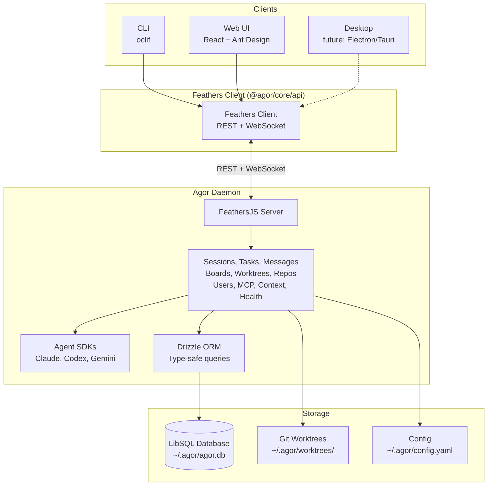
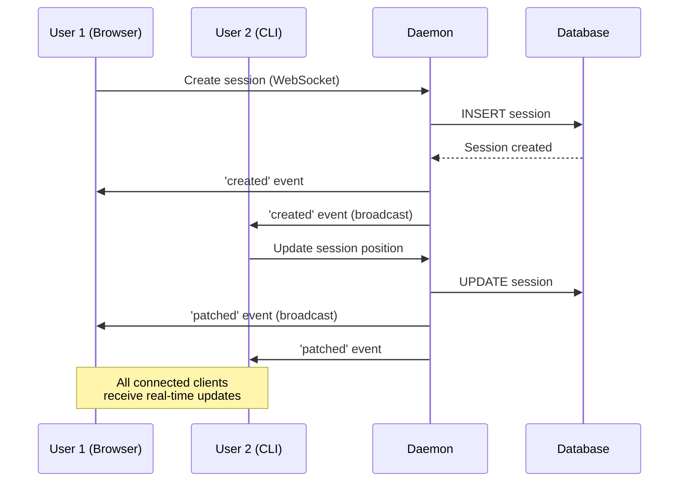

# Architecture Overview

Agor is a **multi-client agent orchestration platform** with real-time collaboration, built on a local-first daemon architecture.

## System Architecture



## Technology Stack

### Backend
- **[FeathersJS](https://feathersjs.com/)** - Unified REST + WebSocket API framework
- **[Drizzle ORM](https://orm.drizzle.team/)** - Type-safe database layer with LibSQL support
- **[LibSQL](https://github.com/tursodatabase/libsql)** - Local SQLite-compatible database (future: cloud sync via Turso)
- **[simple-git](https://github.com/steveukx/simple-git)** - Git operations for worktree management

### Frontend
- **[React 18](https://react.dev/)** + **[Vite](https://vitejs.dev/)** - Fast development with HMR
- **[Ant Design](https://ant.design/)** - Enterprise UI component library
- **[React Flow](https://reactflow.dev/)** - Interactive session canvas with drag-and-drop
- **[Socket.IO Client](https://socket.io/)** - Real-time WebSocket connection

### CLI
- **[oclif](https://oclif.io/)** - Enterprise-grade CLI framework

### Agent Integration
- **[@anthropic-ai/claude-agent-sdk](https://github.com/anthropics/claude-agent-sdk)** - Claude Code capabilities with CLAUDE.md auto-loading
- **[OpenAI SDK](https://github.com/openai/openai-node)** - Codex integration with custom permission system
- **[Google Generative AI SDK](https://ai.google.dev/)** - Gemini integration (beta)

## Real-Time Multiplayer

Agor achieves multiplayer collaboration through **FeathersJS real-time events**:

### WebSocket Event Flow



**Key Features:**
- **Automatic broadcasting** - FeathersJS emits events to all connected clients
- **Service-level events** - `created`, `patched`, `removed`, `updated`
- **Custom events** - Cursor position, presence updates (100ms throttle)
- **Optimistic UI** - React hooks listen to events and update state immediately

## Core Services

The daemon exposes 12 FeathersJS services via REST and WebSocket:

| Service | Purpose | Key Operations |
|---------|---------|----------------|
| **sessions** | Agent sessions with genealogy | CRUD, fork, spawn, prompt execution |
| **tasks** | Work units within sessions | CRUD, completion tracking |
| **messages** | Conversation history | CRUD, bulk insert, streaming |
| **boards** | Spatial session organization | CRUD, session positioning |
| **worktrees** | Git worktree isolation | Create, list, delete worktrees |
| **repos** | Git repository management | Clone, list, worktree operations |
| **users** | User accounts & auth | CRUD, JWT authentication |
| **mcp-servers** | MCP server configs | CRUD, capability queries |
| **session-mcp-servers** | Session MCP links | Associate MCP servers with sessions |
| **context** | Context file browser | Read-only access to context/ files |
| **terminals** | WebSocket terminal proxy | PTY sessions for live terminals |
| **health-monitor** | Real-time diagnostics | System health, connection status |

## Data Architecture

### Hybrid Schema Strategy

Agor uses a **hybrid materialization approach** for cross-database compatibility (LibSQL → PostgreSQL):

**Materialized Columns** (indexed):
- Primary keys, foreign keys, status, timestamps
- Used for filtering, joins, sorting

**JSON Blobs** (flexible):
- Nested objects (git_state, genealogy, config)
- Arrays (tasks, contextFiles, children)
- Rarely queried metadata

**Benefits:**
- Migration-free schema evolution
- Fast indexed queries
- Cross-database compatibility (LibSQL ↔ PostgreSQL)

### Worktree-Based Isolation

Every session requires a worktree (foreign key constraint):

```
~/.agor/
├── agor.db              # Database
├── repos/               # Bare repositories
│   └── myapp/
└── worktrees/           # Session worktrees
    └── myapp/
        ├── main/        # Session 1 worktree
        └── feat-auth/   # Session 2 worktree
```

**Why worktrees?**
- Parallel development without branch switching
- Session isolation (no shared working directory)
- Natural mapping for fork/spawn operations

## Authentication

Three authentication strategies:

1. **Anonymous** (default) - No auth required for local development
2. **Local** (email/password) - JWT-based authentication
3. **JWT** - Token refresh and validation

All strategies use FeathersJS authentication with configurable storage.

## Next Steps

- **[Getting Started](/guide/getting-started)** - Install and run Agor
- **[API Reference](/api-reference)** - REST endpoints and WebSocket events
- **[CLI Reference](/cli)** - Command-line interface
