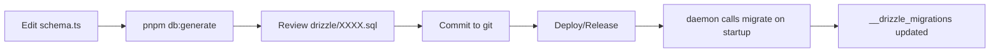

# Database Migration System

**Status:** Design
**Priority:** Launch Blocker (from PROJECT.md)
**Issue:** [#26](https://github.com/mistercrunch/agor/issues/26)

---

## Overview

Replace ad-hoc migration scripts with Drizzle's built-in migration system. This provides automatic schema migrations for releases with proper version tracking, while maintaining SQLite support and future-proofing for Postgres.

**Goals:**

- Automatic schema migrations on releases
- Version tracking in database
- Single source of truth (schema.ts)
- SQLite + Postgres compatibility
- Zero custom rollback logic (not needed)

**Non-Goals:**

- Custom rollback system (Drizzle doesn't provide, we don't need)
- Complex data integrity validation (can add later if needed)
- Support for other databases beyond SQLite/Postgres

---

## Current State

### Problems

1. **Ad-hoc migrations:** 7 manual scripts in `packages/core/src/db/scripts/migrate-*.ts`
2. **No version tracking:** No way to know what migrations ran
3. **Duplicate schema definitions:** Both `schema.ts` (Drizzle) and `migrate.ts` (raw SQL)
4. **Fragile upgrades:** `initializeDatabase()` has hardcoded table checks (lines 508-598)
5. **No rollback:** Can't undo problematic changes
6. **Not designed:** Existing code is byproduct of iterations

### What We Have

```
packages/core/src/db/
├── schema.ts                              # Drizzle schema (source of truth)
├── migrate.ts                             # Manual SQL + initializeDatabase()
├── scripts/
│   ├── migrate-add-mcp-tables.ts         # DELETE
│   ├── migrate-add-onboarding-completed.ts   # DELETE
│   ├── migrate-add-permission-request-message-type.ts  # DELETE
│   ├── migrate-add-worktree-unique-id.ts  # DELETE
│   ├── migrate-agent-to-agentic-tool.ts   # DELETE
│   ├── migrate-cascade-delete.ts          # DELETE
│   └── migrate-add-awaiting-permission-status.ts  # DELETE
└── drizzle.config.ts                     # Drizzle Kit config (already exists)
```

### What Drizzle Provides

✅ **drizzle-kit generate** - Auto-generates SQL from schema.ts diffs
✅ **drizzle-kit push** - Direct schema sync (dev only)
✅ **migrate()** function - Runs SQL files, tracks state, uses transactions
✅ **\_\_drizzle_migrations** table - Auto-created version tracking
❌ **No rollback** - Not provided by Drizzle

---

## Architecture

### New Structure

```
packages/core/src/db/
├── schema.ts                    # KEEP: Single source of truth
├── migrate.ts                   # REWRITE: Simple wrapper around drizzle migrate()
├── drizzle.config.ts            # KEEP: Already configured
├── drizzle/                     # NEW: Generated migration files
│   ├── 0000_initial_schema.sql  # Baseline from current schema
│   ├── meta/
│   │   ├── _journal.json        # Drizzle's migration manifest
│   │   └── 0000_snapshot.json   # Schema snapshot per migration
│   └── (future migrations auto-generated here)
└── scripts/
    ├── setup-db.ts              # KEEP: Uses new migrate()
    └── migrate-*.ts             # DELETE ALL (replaced by drizzle/)
```

### Migration Flow



### CLI Commands

```bash
# Developer workflow
pnpm db:generate     # drizzle-kit generate (creates SQL)
pnpm db:migrate      # Run pending migrations
pnpm db:status       # Show migration state

# User workflow (via agor CLI)
agor db migrate      # Run pending migrations
agor db status       # Show applied migrations
```

---

## Implementation Plan

### Phase 1: Generate Baseline Migration

**Goal:** Create fresh starting point from current schema

**Steps:**

1. **Delete old migration scripts**

   ```bash
   rm packages/core/src/db/scripts/migrate-*.ts
   ```

2. **Generate baseline from schema.ts**

   ```bash
   cd packages/core
   pnpm db:generate
   # Creates: drizzle/0000_initial_schema.sql
   ```

3. **Verify generated SQL**
   - Check all tables match schema.ts
   - Verify indexes, foreign keys, constraints
   - Ensure SQLite + Postgres compatible syntax

**Deliverable:** `drizzle/0000_initial_schema.sql` with full schema

---

### Phase 2: Rewrite migrate.ts

**Goal:** Replace manual SQL with Drizzle's migrate()

**Current code to remove:**

- `createInitialSchema()` function (lines 82-454)
- `initializeDatabase()` function (lines 508-598)
- All manual table creation SQL
- All manual index creation

**New implementation:**

```typescript
// packages/core/src/db/migrate.ts

import { migrate } from 'drizzle-orm/libsql/migrator';
import type { Database } from './client';

export class MigrationError extends Error {
  constructor(
    message: string,
    public readonly cause?: unknown
  ) {
    super(message);
    this.name = 'MigrationError';
  }
}

/**
 * Run all pending database migrations
 *
 * Uses Drizzle's built-in migration system:
 * - Reads SQL files from drizzle/ folder
 * - Tracks applied migrations in __drizzle_migrations table
 * - Runs migrations in transaction (auto-rollback on failure)
 *
 * Safe to call multiple times - only runs pending migrations.
 */
export async function runMigrations(db: Database): Promise<void> {
  try {
    console.log('Running database migrations...');

    // Drizzle handles everything:
    // 1. Creates __drizzle_migrations table if needed
    // 2. Checks which migrations are pending
    // 3. Runs them in order within transaction
    // 4. Updates tracking table
    await migrate(db, { migrationsFolder: './drizzle' });

    console.log('Migrations complete');
  } catch (error) {
    throw new MigrationError(
      `Migration failed: ${error instanceof Error ? error.message : String(error)}`,
      error
    );
  }
}

/**
 * DEPRECATED: Use runMigrations() instead
 *
 * Kept for backwards compatibility during transition.
 * Will be removed in future version.
 */
export async function initializeDatabase(db: Database): Promise<void> {
  console.warn('initializeDatabase() is deprecated. Use runMigrations() instead.');
  await runMigrations(db);
}

/**
 * Seed initial data (default board)
 *
 * Run AFTER migrations complete.
 */
export async function seedInitialData(db: Database): Promise<void> {
  // ... keep existing implementation
}
```

**Future-proofing for Postgres:**

- `migrate()` is dialect-agnostic (works with both SQLite and Postgres)
- Migration folder path is configurable via drizzle.config.ts
- When adding Postgres: create separate `drizzle.config.postgres.ts`

**File locations:**

- `packages/core/src/db/migrate.ts` - Migration runner
- `packages/core/drizzle.config.ts` - Already configured correctly

---

### Phase 3: Update Daemon Startup

**Goal:** Auto-run migrations when daemon starts

**Location:** `apps/agor-daemon/src/index.ts`

**Changes:**

```typescript
// apps/agor-daemon/src/index.ts

import { createDatabase, runMigrations, seedInitialData } from '@agor/core/db';

// ... existing imports

async function startDaemon() {
  const db = createDatabase({ url: dbPath });

  // Run migrations on startup (safe to call every time)
  await runMigrations(db);

  // Seed default data if needed
  await seedInitialData(db);

  // ... rest of daemon setup
}
```

**Why on startup?**

- Users shouldn't need to run manual migration commands
- Safe: `migrate()` only runs pending migrations
- Fast: Migration check is quick, actual migrations rare
- Automatic: Works for both fresh installs and upgrades

---

### Phase 4: Add CLI Commands

**Goal:** Give users visibility and control over migrations

**Location:** `apps/agor-cli/src/commands/db/`

**New command structure:**

```
apps/agor-cli/src/commands/db/
├── migrate.ts       # NEW: Run pending migrations
├── status.ts        # NEW: Show migration history
└── generate.ts      # NEW: Developer-only (wraps drizzle-kit)
```

**Command implementations:**

```typescript
// apps/agor-cli/src/commands/db/migrate.ts
import { Command } from '@oclif/core';
import { createDatabase, runMigrations } from '@agor/core/db';

export default class DbMigrate extends Command {
  static description = 'Run pending database migrations';

  async run(): Promise<void> {
    const db = createDatabase({ url: dbPath });
    await runMigrations(db);
    this.log('✅ Database is up to date');
  }
}
```

```typescript
// apps/agor-cli/src/commands/db/status.ts
import { Command } from '@oclif/core';
import { createDatabase, sql } from '@agor/core/db';

export default class DbStatus extends Command {
  static description = 'Show applied database migrations';

  async run(): Promise<void> {
    const db = createDatabase({ url: dbPath });

    // Query Drizzle's tracking table
    const result = await db.run(sql`
      SELECT * FROM __drizzle_migrations
      ORDER BY created_at DESC
    `);

    if (result.rows.length === 0) {
      this.log('No migrations applied yet');
      return;
    }

    this.log('Applied migrations:');
    result.rows.forEach((row: any) => {
      this.log(`  ${row.hash} - ${row.created_at}`);
    });
  }
}
```

```typescript
// apps/agor-cli/src/commands/db/generate.ts
import { Command } from '@oclif/core';
import { execSync } from 'child_process';

export default class DbGenerate extends Command {
  static description = 'Generate migration from schema changes (developers only)';

  async run(): Promise<void> {
    this.log('Generating migration...');
    execSync('pnpm db:generate', {
      cwd: './packages/core',
      stdio: 'inherit',
    });
    this.log('✅ Migration generated in packages/core/drizzle/');
  }
}
```

**Usage:**

```bash
agor db migrate      # Run pending migrations
agor db status       # Show what's been applied
agor db generate     # (Dev only) Generate new migration
```

---

### Phase 5: Bootstrap Existing Databases

**Problem:** Existing Agor instances have database without `__drizzle_migrations` table

**Solution:** One-time bootstrap script

**Location:** `packages/core/src/db/scripts/bootstrap-migrations.ts`

```typescript
/**
 * Bootstrap existing databases to use Drizzle migrations
 *
 * For databases created before migration system:
 * - Creates __drizzle_migrations table
 * - Marks baseline migration as applied
 * - Allows future migrations to run normally
 *
 * Safe to run multiple times (idempotent).
 * Only needed once per existing database.
 */

import { createDatabase } from '../client';
import { sql } from 'drizzle-orm';

const DB_PATH = process.env.AGOR_DB_PATH || 'file:~/.agor/agor.db';

async function bootstrap() {
  const db = createDatabase({ url: DB_PATH });

  console.log('🔧 Bootstrapping migration tracking...');

  // 1. Check if migrations table already exists
  const result = await db.run(sql`
    SELECT name FROM sqlite_master
    WHERE type='table' AND name='__drizzle_migrations'
  `);

  if (result.rows.length > 0) {
    console.log('✅ Already bootstrapped (migrations table exists)');
    return;
  }

  // 2. Create migrations table (Drizzle's schema)
  await db.run(sql`
    CREATE TABLE __drizzle_migrations (
      id INTEGER PRIMARY KEY AUTOINCREMENT,
      hash TEXT NOT NULL,
      created_at INTEGER NOT NULL
    )
  `);

  // 3. Mark baseline migration as applied
  // Use hash from drizzle/meta/_journal.json after generating baseline
  const baselineHash = '0000_initial_schema'; // Update after generation
  await db.run(sql`
    INSERT INTO __drizzle_migrations (hash, created_at)
    VALUES (${baselineHash}, ${Date.now()})
  `);

  console.log('✅ Bootstrap complete!');
  console.log('   Baseline migration marked as applied');
  console.log('   Future migrations will run normally');
}

bootstrap()
  .then(() => process.exit(0))
  .catch(error => {
    console.error('❌ Bootstrap failed:', error);
    process.exit(1);
  });
```

**For your current instance:**

```bash
# After baseline migration is generated:
cd packages/core
tsx src/db/scripts/bootstrap-migrations.ts

# Verify:
sqlite3 ~/.agor/agor.db "SELECT * FROM __drizzle_migrations"
```

**For end users:**

This script will be run automatically by daemon on first startup after upgrade:

```typescript
// In daemon startup (apps/agor-daemon/src/index.ts)

async function startDaemon() {
  const db = createDatabase({ url: dbPath });

  // Check if migrations table exists
  const hasMigrations = await checkMigrationsTable(db);

  if (!hasMigrations) {
    // First time with new migration system
    await bootstrapMigrations(db);
  }

  // Now run normal migrations
  await runMigrations(db);

  // ... rest
}
```

---

## Future-Proofing for Postgres

### Drizzle Already Supports This

When Postgres support is added:

1. **Create Postgres config**

   ```typescript
   // packages/core/drizzle.config.postgres.ts
   export default defineConfig({
     schema: './src/db/schema.ts', // Same schema!
     out: './drizzle-pg', // Separate migration folder
     dialect: 'postgresql',
     dbCredentials: {
       url: process.env.DATABASE_URL,
     },
   });
   ```

2. **Generate Postgres migrations**

   ```bash
   pnpm drizzle-kit generate --config=drizzle.config.postgres.ts
   ```

3. **Use same migrate() function**
   ```typescript
   import { migrate } from 'drizzle-orm/postgres-js/migrator';
   // Same API, different dialect
   ```

### Schema.ts Compatibility

**Current SQLite-specific patterns to avoid:**

❌ **Don't do this:**

```typescript
onboarding_completed: integer('onboarding_completed', { mode: 'boolean' });
```

✅ **Do this instead:**

```typescript
onboarding_completed: integer('onboarding_completed', { mode: 'boolean' }).notNull().default(false);
// Drizzle translates to BOOLEAN for Postgres, INTEGER for SQLite
```

**Already compatible:**

- All current schema uses Drizzle's type system ✅
- JSON columns use `.mode('json')` (works both) ✅
- Timestamps use `integer('created_at', { mode: 'timestamp_ms' })` (portable) ✅
- Foreign keys use `.references()` (dialect-agnostic) ✅

**Future guidance:**

- Always use Drizzle type methods (never raw SQL types)
- Test migrations against both SQLite and Postgres in CI
- Keep migrations in separate folders (drizzle/ for SQLite, drizzle-pg/ for Postgres)

---

## Testing Strategy

### Manual Testing

```bash
# 1. Test fresh install
rm -rf ~/.agor/agor.db
agor init
agor daemon start
# Verify: migrations ran, tables created

# 2. Test schema change
# Edit schema.ts (add column)
pnpm db:generate
# Verify: SQL generated correctly

# 3. Test migration application
agor db migrate
# Verify: New column exists

# 4. Test idempotency
agor db migrate
# Verify: "No pending migrations" message
```

### Automated Testing

```typescript
// packages/core/src/db/migrate.test.ts

describe('Database Migrations', () => {
  it('should run baseline migration on fresh database', async () => {
    const db = createTestDatabase();
    await runMigrations(db);

    // Verify all tables exist
    const tables = await db.run(sql`
      SELECT name FROM sqlite_master WHERE type='table'
    `);
    expect(tables.rows).toContainEqual({ name: 'sessions' });
    expect(tables.rows).toContainEqual({ name: 'tasks' });
    // ... etc
  });

  it('should track applied migrations', async () => {
    const db = createTestDatabase();
    await runMigrations(db);

    const migrations = await db.run(sql`
      SELECT * FROM __drizzle_migrations
    `);
    expect(migrations.rows.length).toBeGreaterThan(0);
  });

  it('should be idempotent', async () => {
    const db = createTestDatabase();
    await runMigrations(db);
    await runMigrations(db); // Run twice

    // Should not error, should not duplicate
    const migrations = await db.run(sql`
      SELECT * FROM __drizzle_migrations
    `);
    expect(migrations.rows.length).toBe(1); // Still just baseline
  });
});
```

---

## Migration Checklist

**Phase 1: Generate Baseline**

- [ ] Delete old migration scripts (`packages/core/src/db/scripts/migrate-*.ts`)
- [ ] Run `pnpm db:generate` to create `drizzle/0000_initial_schema.sql`
- [ ] Review generated SQL for correctness
- [ ] Verify SQLite + Postgres compatible syntax
- [ ] Commit baseline migration to git

**Phase 2: Rewrite migrate.ts**

- [ ] Remove `createInitialSchema()` function
- [ ] Remove manual table creation SQL
- [ ] Implement new `runMigrations()` using `migrate()`
- [ ] Keep `seedInitialData()` as-is
- [ ] Add deprecation warning to `initializeDatabase()`
- [ ] Update exports in `packages/core/src/db/index.ts`

**Phase 3: Update Daemon**

- [ ] Replace `initializeDatabase()` with `runMigrations()` in daemon startup
- [ ] Add bootstrap check for existing databases
- [ ] Test daemon startup with fresh database
- [ ] Test daemon startup with existing database

**Phase 4: CLI Commands**

- [ ] Create `apps/agor-cli/src/commands/db/migrate.ts`
- [ ] Create `apps/agor-cli/src/commands/db/status.ts`
- [ ] Create `apps/agor-cli/src/commands/db/generate.ts`
- [ ] Test CLI commands end-to-end
- [ ] Update CLI help text

**Phase 5: Bootstrap Existing DBs**

- [ ] Create `packages/core/src/db/scripts/bootstrap-migrations.ts`
- [ ] Test bootstrap script on existing database
- [ ] Add auto-bootstrap to daemon startup
- [ ] Document manual bootstrap for developers

**Documentation**

- [ ] Update CLAUDE.md with new migration workflow
- [ ] Add migration guide to context/concepts/
- [ ] Update README with migration commands
- [ ] Document Postgres future-proofing decisions

**Testing**

- [ ] Write unit tests for migrate.ts
- [ ] Test fresh install flow
- [ ] Test upgrade from old version
- [ ] Test schema change workflow
- [ ] Test bootstrap script

---

## Questions for Implementation

When implementing this design, the executing agent should:

1. **After generating baseline:** Check if `drizzle/meta/_journal.json` has correct hash format
2. **In migrate.ts rewrite:** Confirm path `./drizzle` resolves correctly from daemon runtime
3. **For bootstrap script:** Verify hash value matches generated migration
4. **In daemon startup:** Decide if bootstrap should be automatic or require manual trigger
5. **For CLI commands:** Confirm oclif command structure matches existing patterns

---

## References

- **Issue:** https://github.com/mistercrunch/agor/issues/26
- **Drizzle Migrations:** https://orm.drizzle.team/docs/migrations
- **Current schema:** `packages/core/src/db/schema.ts`
- **Current migrate:** `packages/core/src/db/migrate.ts`
- **Drizzle config:** `packages/core/drizzle.config.ts`

---

## Success Criteria

✅ All ad-hoc migration scripts deleted
✅ Single baseline migration generated from schema.ts
✅ `runMigrations()` uses Drizzle's `migrate()`
✅ Daemon auto-runs migrations on startup
✅ CLI commands for migrate/status/generate
✅ Bootstrap script for existing databases
✅ Tests pass for fresh install and upgrade paths
✅ Documentation updated
✅ Your current Agor instance continues working after bootstrap
