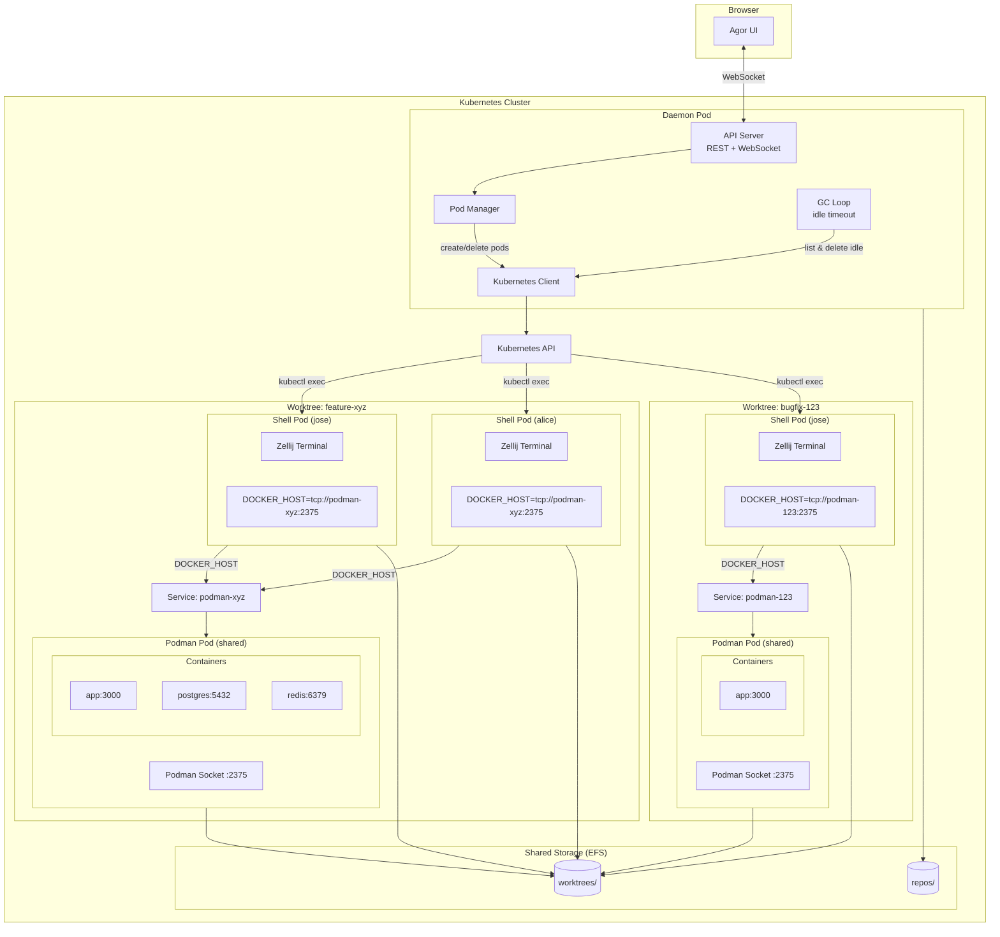
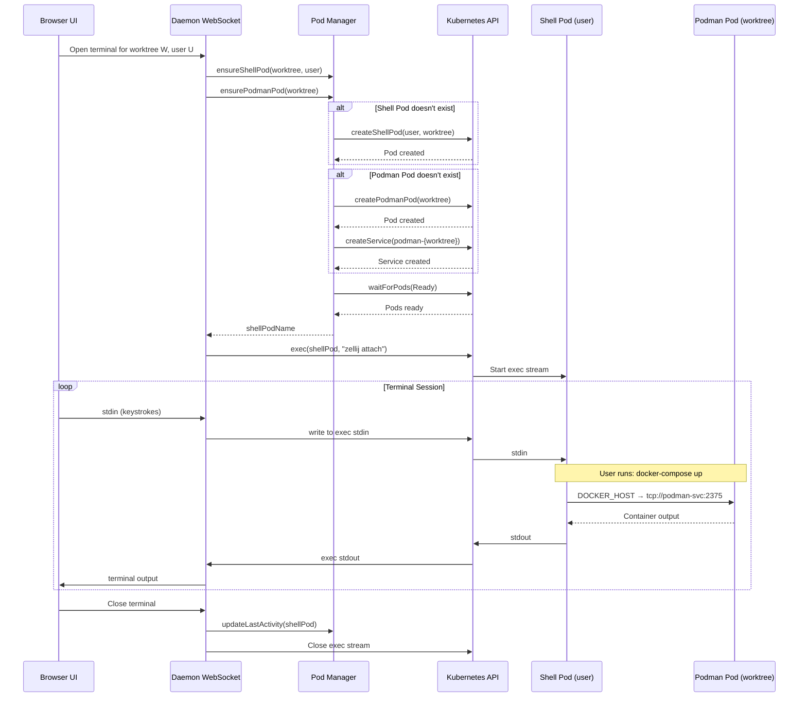
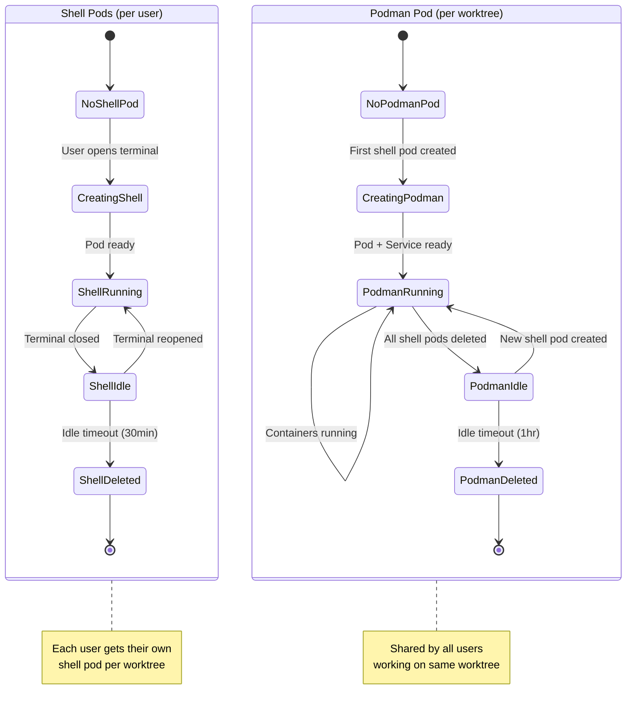
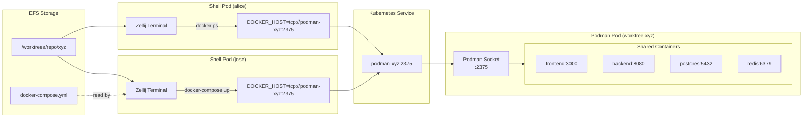

# Isolated Terminal Pods

**Status**: Implementation
**Created**: 2024-12-07
**Updated**: 2024-12-13

## Overview

Enable terminals to run in dedicated Kubernetes Deployments instead of the daemon pod. Each worktree gets its own isolated Podman Deployment for running docker-compose, and each user gets their own Shell Deployment for terminal access.

## Motivation

**Current state**: Terminals (Zellij) run inside the daemon pod
- All users share the same pod
- Cannot run docker-compose (no container runtime)
- Limited isolation between users

**Problems**:
1. No docker-compose support in Kubernetes deployment
2. Users can interfere with each other
3. Resource contention in daemon pod
4. Security: shared filesystem access

## Architecture

### High-Level Design

The architecture separates **Shell Deployments** (isolated per user) from **Podman Deployments** (shared per worktree):

```
Worktree A (feature-xyz)
│
├── Podman Deployment (worktree)     ← Shared containers, runs docker-compose
│   ├── Service: podman-a44d097c:2375
│   ├── app container
│   ├── db container
│   └── redis container
│
├── Shell Deployment (user: jose)    ← Isolated terminal
│   └── DOCKER_HOST → podman-a44d097c:2375
│
└── Shell Deployment (user: alice)   ← Isolated terminal
    └── DOCKER_HOST → podman-a44d097c:2375

Worktree B (bugfix-123)              ← Completely separate
│
├── Podman Deployment (worktree)
│   └── Service: podman-b55e198d:2375
│
└── Shell Deployment (user: jose)    ← Same user, different worktree
    └── DOCKER_HOST → podman-b55e198d:2375
```

### User Actions Flow

**"Start Environment" Button** (per worktree):
1. Creates Podman Deployment if not exists
2. Creates Podman Service (exposes port 2375)
3. Waits for Deployment to be ready
4. Executes `docker-compose up` inside Podman pod

**"Open Terminal" Button** (per user per worktree):
1. Ensures Podman Deployment exists (calls Start Environment flow)
2. Creates Shell Deployment for this user + worktree
3. Sets `DOCKER_HOST=tcp://podman-{worktreeId}.agor.svc:2375`
4. Opens terminal via `kubectl exec`

**Key benefits:**
- Users have isolated terminals (can't see each other's shell history, processes)
- Shared docker-compose stack (both users see same running app)
- One set of containers per worktree (resource efficient)
- Users manage containers via `DOCKER_HOST` environment variable
- Deployments provide self-healing (pods auto-restart on crash)

### Mermaid Diagram



### Terminal Streaming Flow



### Pod Lifecycle



### Docker Compose via DOCKER_HOST



### Components

**1. Daemon Pod (existing)**
- REST/WebSocket API
- Orchestrates shell and Podman pod lifecycle
- Proxies terminal streams via kubectl exec
- Manages Kubernetes Services for Podman pods

**2. Shell Pod (new, per user per worktree)**
- One pod per user per worktree
- Lightweight container with Zellij + docker CLI
- Mounts shared EFS for worktrees/repos
- `DOCKER_HOST` env var points to Podman pod's service
- Isolated: users can't see each other's terminals

**3. Podman Pod (new, per worktree)**
- One pod per worktree (shared by all users)
- Runs Podman with exposed socket (:2375)
- Handles all docker-compose container management
- Mounts shared EFS for worktrees
- Kubernetes Service exposes the socket to shell pods

**4. Shared Storage (EFS)**
- `/worktrees` - All worktree directories
- `/repos` - All cloned repositories
- ReadWriteMany access mode

## Configuration

### Helm Values

```yaml
daemon:
  config:
    execution:
      # Terminal execution mode
      # - daemon: Run terminals in daemon pod (current behavior)
      # - pod: Run terminals in isolated user pods
      terminal_mode: pod

      # User pod configuration (only used when terminal_mode: pod)
      user_pod:
        image: quay.io/podman/stable
        # Idle timeout before pod is garbage collected
        idle_timeout_minutes: 30
        # Resource limits per user pod
        resources:
          requests:
            cpu: 100m
            memory: 256Mi
          limits:
            cpu: 2
            memory: 4Gi
        # Security context
        privileged: true  # Required for Podman
```

### Per-Repo Override (.agor.yml)

```yaml
# .agor.yml
environment:
  # Override terminal mode for this repo
  terminal_mode: pod  # or 'daemon'
```

## Deployment Specifications

### Shell Deployment (per user per worktree)

```yaml
apiVersion: apps/v1
kind: Deployment
metadata:
  name: agor-shell-{worktree_id_short}-{user_id_short}
  namespace: agor
  labels:
    app.kubernetes.io/name: agor-shell-pod
    app.kubernetes.io/component: terminal
    agor.io/worktree-id: "{worktree_id}"
    agor.io/user-id: "{user_id}"
spec:
  replicas: 1
  selector:
    matchLabels:
      app.kubernetes.io/name: agor-shell-pod
      agor.io/worktree-id: "{worktree_id}"
      agor.io/user-id: "{user_id}"
  template:
    metadata:
      labels:
        app.kubernetes.io/name: agor-shell-pod
        app.kubernetes.io/component: terminal
        agor.io/worktree-id: "{worktree_id}"
        agor.io/user-id: "{user_id}"
      annotations:
        agor.io/created-at: "{timestamp}"
        agor.io/last-activity: "{timestamp}"
    spec:
      serviceAccountName: agor-shell-pod
      securityContext:
        fsGroup: {user_unix_uid}  # For EFS file permissions
      initContainers:
      - name: init-user
        image: busybox:1.36
        securityContext:
          runAsUser: 0
          runAsGroup: 0
        command: ["sh", "-c"]
        args:
        - |
          # Create /etc/passwd and /etc/group with user's UID
          cat > /etc-override/passwd << 'EOF'
          root:x:0:0:root:/root:/bin/sh
          nobody:x:65534:65534:nobody:/nonexistent:/usr/sbin/nologin
          EOF
          echo "{username}:x:{uid}:{gid}:{username}:/home/agor:/bin/bash" >> /etc-override/passwd
          cat > /etc-override/group << 'EOF'
          root:x:0:
          nobody:x:65534:
          EOF
          echo "{username}:x:{gid}:" >> /etc-override/group
          chmod 644 /etc-override/passwd /etc-override/group
        volumeMounts:
        - name: etc-override
          mountPath: /etc-override
      containers:
      - name: shell
        image: agor/shell:dev
        command: ["sleep", "infinity"]
        securityContext:
          runAsUser: {user_unix_uid}
          runAsGroup: {user_unix_uid}
          runAsNonRoot: true
        env:
        - name: WORKTREE_PATH
          value: "{worktree_path}"
        - name: DOCKER_HOST
          value: "tcp://podman-{worktree_id_short}.agor.svc:2375"
        - name: HOME
          value: "/home/agor"
        - name: USER
          value: "{username}"
        volumeMounts:
        - name: data
          mountPath: /data
        - name: etc-override
          mountPath: /etc/passwd
          subPath: passwd
        - name: etc-override
          mountPath: /etc/group
          subPath: group
        workingDir: "{worktree_path}"
        resources:
          requests:
            cpu: 50m
            memory: 128Mi
          limits:
            cpu: 1
            memory: 1Gi
      volumes:
      - name: data
        persistentVolumeClaim:
          claimName: agor-data
      - name: etc-override
        emptyDir: {}
```

### Podman Deployment (per worktree, shared)

```yaml
apiVersion: apps/v1
kind: Deployment
metadata:
  name: agor-podman-{worktree_id_short}
  namespace: agor
  labels:
    app.kubernetes.io/name: agor-podman-pod
    app.kubernetes.io/component: container-runtime
    agor.io/worktree-id: "{worktree_id}"
spec:
  replicas: 1
  selector:
    matchLabels:
      app.kubernetes.io/name: agor-podman-pod
      agor.io/worktree-id: "{worktree_id}"
  template:
    metadata:
      labels:
        app.kubernetes.io/name: agor-podman-pod
        app.kubernetes.io/component: container-runtime
        agor.io/worktree-id: "{worktree_id}"
      annotations:
        agor.io/created-at: "{timestamp}"
        agor.io/last-activity: "{timestamp}"
    spec:
      serviceAccountName: agor-podman-pod
      containers:
      - name: podman
        image: quay.io/podman/stable
        command:
        - podman
        - system
        - service
        - --time=0
        - tcp://0.0.0.0:2375
        securityContext:
          privileged: true  # Required for nested containers
        ports:
        - containerPort: 2375
          name: docker-api
          protocol: TCP
        env:
        - name: WORKTREE_PATH
          value: "{worktree_path}"
        volumeMounts:
        - name: data
          mountPath: /data
        - name: podman-storage
          mountPath: /var/lib/containers
        workingDir: "{worktree_path}"
        resources:
          requests:
            cpu: 100m
            memory: 256Mi
          limits:
            cpu: 4
            memory: 8Gi
        readinessProbe:
          tcpSocket:
            port: 2375
          initialDelaySeconds: 2
          periodSeconds: 5
      volumes:
      - name: data
        persistentVolumeClaim:
          claimName: agor-data
      - name: podman-storage
        emptyDir: {}
---
apiVersion: v1
kind: Service
metadata:
  name: podman-{worktree_id_short}
  namespace: agor
  labels:
    agor.io/worktree-id: "{worktree_id}"
spec:
  selector:
    app.kubernetes.io/name: agor-podman-pod
    agor.io/worktree-id: "{worktree_id}"
  ports:
  - port: 2375
    targetPort: 2375
    name: docker-api
    protocol: TCP
```

### Shell Pod Image (Dockerfile.shell)

```dockerfile
FROM debian:bookworm-slim

# Install essentials
RUN apt-get update && apt-get install -y \
    curl \
    git \
    ca-certificates \
    docker.io \
    && rm -rf /var/lib/apt/lists/*

# Install Zellij
RUN curl -fsSL https://github.com/zellij-org/zellij/releases/latest/download/zellij-x86_64-unknown-linux-musl.tar.gz \
    | tar -xz -C /usr/local/bin

# Create agor user
RUN useradd -m -s /bin/bash agor

USER agor
WORKDIR /home/agor

CMD ["sleep", "infinity"]
```

## Terminal Streaming via kubectl exec

### Flow

```
1. UI requests terminal for worktree W
2. Daemon receives WebSocket connection
3. Daemon checks: does pod exist for W?
   - No: Create pod, wait for Ready
   - Yes: Use existing pod
4. Daemon creates exec stream:
   kubectl exec -it agor-worktree-{id} -- zellij attach -c main
5. Daemon pipes:
   - UI WebSocket stdin → exec stdin
   - exec stdout → UI WebSocket
6. On disconnect: update last-activity timestamp
```

### Implementation (TypeScript)

```typescript
import * as k8s from '@kubernetes/client-node';

class PodManager {
  private kc: k8s.KubeConfig;
  private k8sApi: k8s.CoreV1Api;
  private exec: k8s.Exec;
  private namespace = 'agor';

  constructor() {
    this.kc = new k8s.KubeConfig();
    this.kc.loadFromCluster(); // In-cluster config
    this.k8sApi = this.kc.makeApiClient(k8s.CoreV1Api);
    this.exec = new k8s.Exec(this.kc);
  }

  /**
   * Ensure shell pod exists for user + worktree
   */
  async ensureShellPod(worktree: Worktree, user: User): Promise<string> {
    const worktreeShort = worktree.worktree_id.slice(0, 8);
    const userShort = user.user_id.slice(0, 8);
    const shellPodName = `agor-shell-${worktreeShort}-${userShort}`;

    // Also ensure Podman pod exists (shared for worktree)
    await this.ensurePodmanPod(worktree);

    try {
      const { body: pod } = await this.k8sApi.readNamespacedPod(shellPodName, this.namespace);
      if (pod.status?.phase === 'Running') {
        return shellPodName;
      }
      await this.waitForPod(shellPodName);
      return shellPodName;
    } catch (e: any) {
      if (e.statusCode === 404) {
        await this.createShellPod(worktree, user);
        await this.waitForPod(shellPodName);
        return shellPodName;
      }
      throw e;
    }
  }

  /**
   * Ensure Podman pod exists for worktree (shared by all users)
   */
  async ensurePodmanPod(worktree: Worktree): Promise<string> {
    const worktreeShort = worktree.worktree_id.slice(0, 8);
    const podmanPodName = `agor-podman-${worktreeShort}`;
    const serviceName = `podman-${worktreeShort}`;

    try {
      const { body: pod } = await this.k8sApi.readNamespacedPod(podmanPodName, this.namespace);
      if (pod.status?.phase === 'Running') {
        return podmanPodName;
      }
      await this.waitForPod(podmanPodName);
      return podmanPodName;
    } catch (e: any) {
      if (e.statusCode === 404) {
        // Create Podman pod
        await this.createPodmanPod(worktree);
        // Create Service to expose Podman socket
        await this.createPodmanService(worktree);
        await this.waitForPod(podmanPodName);
        return podmanPodName;
      }
      throw e;
    }
  }

  /**
   * Create shell pod for user
   */
  async createShellPod(worktree: Worktree, user: User): Promise<void> {
    const worktreeShort = worktree.worktree_id.slice(0, 8);
    const userShort = user.user_id.slice(0, 8);

    const manifest: k8s.V1Pod = {
      metadata: {
        name: `agor-shell-${worktreeShort}-${userShort}`,
        namespace: this.namespace,
        labels: {
          'app.kubernetes.io/name': 'agor-shell-pod',
          'app.kubernetes.io/component': 'terminal',
          'agor.io/worktree-id': worktree.worktree_id,
          'agor.io/user-id': user.user_id,
        },
        annotations: {
          'agor.io/created-at': new Date().toISOString(),
          'agor.io/last-activity': new Date().toISOString(),
        },
      },
      spec: {
        serviceAccountName: 'agor-shell-pod',
        containers: [
          {
            name: 'shell',
            image: 'agor/shell:latest',
            command: ['sleep', 'infinity'],
            env: [
              { name: 'WORKTREE_PATH', value: worktree.path },
              { name: 'DOCKER_HOST', value: `tcp://podman-${worktreeShort}.${this.namespace}.svc:2375` },
            ],
            workingDir: worktree.path,
            volumeMounts: [
              { name: 'worktrees', mountPath: '/worktrees' },
              { name: 'repos', mountPath: '/repos' },
            ],
            resources: {
              requests: { cpu: '50m', memory: '128Mi' },
              limits: { cpu: '1', memory: '1Gi' },
            },
          },
        ],
        volumes: [
          { name: 'worktrees', persistentVolumeClaim: { claimName: 'agor-worktrees' } },
          { name: 'repos', persistentVolumeClaim: { claimName: 'agor-repos' } },
        ],
      },
    };

    await this.k8sApi.createNamespacedPod(this.namespace, manifest);
  }

  /**
   * Create Podman pod for worktree
   */
  async createPodmanPod(worktree: Worktree): Promise<void> {
    const worktreeShort = worktree.worktree_id.slice(0, 8);

    const manifest: k8s.V1Pod = {
      metadata: {
        name: `agor-podman-${worktreeShort}`,
        namespace: this.namespace,
        labels: {
          'app.kubernetes.io/name': 'agor-podman-pod',
          'app.kubernetes.io/component': 'container-runtime',
          'agor.io/worktree-id': worktree.worktree_id,
        },
        annotations: {
          'agor.io/created-at': new Date().toISOString(),
          'agor.io/last-activity': new Date().toISOString(),
        },
      },
      spec: {
        serviceAccountName: 'agor-podman-pod',
        containers: [
          {
            name: 'podman',
            image: 'quay.io/podman/stable',
            command: ['podman', 'system', 'service', '--time=0', 'tcp://0.0.0.0:2375'],
            securityContext: { privileged: true },
            ports: [{ containerPort: 2375, name: 'docker-api' }],
            env: [{ name: 'WORKTREE_PATH', value: worktree.path }],
            workingDir: worktree.path,
            volumeMounts: [
              { name: 'worktrees', mountPath: '/worktrees' },
              { name: 'podman-storage', mountPath: '/var/lib/containers' },
            ],
            resources: {
              requests: { cpu: '100m', memory: '256Mi' },
              limits: { cpu: '4', memory: '8Gi' },
            },
          },
        ],
        volumes: [
          { name: 'worktrees', persistentVolumeClaim: { claimName: 'agor-worktrees' } },
          { name: 'podman-storage', emptyDir: {} },
        ],
      },
    };

    await this.k8sApi.createNamespacedPod(this.namespace, manifest);
  }

  /**
   * Create Service for Podman pod
   */
  async createPodmanService(worktree: Worktree): Promise<void> {
    const worktreeShort = worktree.worktree_id.slice(0, 8);

    const manifest: k8s.V1Service = {
      metadata: {
        name: `podman-${worktreeShort}`,
        namespace: this.namespace,
        labels: { 'agor.io/worktree-id': worktree.worktree_id },
      },
      spec: {
        selector: {
          'app.kubernetes.io/name': 'agor-podman-pod',
          'agor.io/worktree-id': worktree.worktree_id,
        },
        ports: [{ port: 2375, targetPort: 2375, name: 'docker-api' }],
      },
    };

    await this.k8sApi.createNamespacedService(this.namespace, manifest);
  }

  /**
   * Stream terminal session via kubectl exec
   */
  async execTerminal(
    shellPodName: string,
    onData: (data: string) => void,
    onClose: () => void
  ): Promise<{ write: (data: string) => void; close: () => void }> {
    const ws = await this.exec.exec(
      this.namespace,
      shellPodName,
      'shell',
      ['zellij', 'attach', '-c', 'main'],
      process.stdout,
      process.stderr,
      process.stdin,
      true, // tty
      (status) => {
        console.log('Exec closed:', status);
        onClose();
      }
    );

    return {
      write: (data: string) => ws.stdin.write(data),
      close: () => ws.close(),
    };
  }

  /**
   * Update last activity timestamp
   */
  async updateLastActivity(podName: string): Promise<void> {
    await this.k8sApi.patchNamespacedPod(
      podName,
      this.namespace,
      { metadata: { annotations: { 'agor.io/last-activity': new Date().toISOString() } } },
      undefined,
      undefined,
      undefined,
      undefined,
      undefined,
      { headers: { 'Content-Type': 'application/merge-patch+json' } }
    );
  }

  /**
   * Garbage collect idle shell pods
   */
  async gcIdleShellPods(idleTimeoutMinutes: number): Promise<void> {
    const { body: pods } = await this.k8sApi.listNamespacedPod(
      this.namespace,
      undefined, undefined, undefined, undefined,
      'app.kubernetes.io/component=terminal'
    );

    const now = Date.now();
    for (const pod of pods.items) {
      const lastActivity = pod.metadata?.annotations?.['agor.io/last-activity'];
      if (lastActivity) {
        const idleMs = now - new Date(lastActivity).getTime();
        if (idleMs > idleTimeoutMinutes * 60 * 1000) {
          console.log(`GC: Deleting idle shell pod ${pod.metadata?.name}`);
          await this.k8sApi.deleteNamespacedPod(pod.metadata!.name!, this.namespace);
        }
      }
    }
  }

  /**
   * Garbage collect Podman pods with no active shell pods
   */
  async gcOrphanedPodmanPods(idleTimeoutMinutes: number): Promise<void> {
    // Get all Podman pods
    const { body: podmanPods } = await this.k8sApi.listNamespacedPod(
      this.namespace,
      undefined, undefined, undefined, undefined,
      'app.kubernetes.io/component=container-runtime'
    );

    // Get all shell pods
    const { body: shellPods } = await this.k8sApi.listNamespacedPod(
      this.namespace,
      undefined, undefined, undefined, undefined,
      'app.kubernetes.io/component=terminal'
    );

    // Get worktree IDs with active shell pods
    const activeWorktreeIds = new Set(
      shellPods.items.map(p => p.metadata?.labels?.['agor.io/worktree-id']).filter(Boolean)
    );

    const now = Date.now();
    for (const pod of podmanPods.items) {
      const worktreeId = pod.metadata?.labels?.['agor.io/worktree-id'];
      const lastActivity = pod.metadata?.annotations?.['agor.io/last-activity'];

      // If no shell pods reference this worktree and it's idle, delete it
      if (worktreeId && !activeWorktreeIds.has(worktreeId) && lastActivity) {
        const idleMs = now - new Date(lastActivity).getTime();
        if (idleMs > idleTimeoutMinutes * 60 * 1000) {
          console.log(`GC: Deleting orphaned Podman pod ${pod.metadata?.name}`);
          await this.k8sApi.deleteNamespacedPod(pod.metadata!.name!, this.namespace);
          // Also delete the service
          await this.k8sApi.deleteNamespacedService(`podman-${worktreeId.slice(0, 8)}`, this.namespace);
        }
      }
    }
  }

  private async waitForPod(podName: string, timeoutMs = 60000): Promise<void> {
    const start = Date.now();
    while (Date.now() - start < timeoutMs) {
      const { body: pod } = await this.k8sApi.readNamespacedPod(podName, this.namespace);
      if (pod.status?.phase === 'Running') {
        return;
      }
      await new Promise(resolve => setTimeout(resolve, 1000));
    }
    throw new Error(`Timeout waiting for pod ${podName} to be ready`);
  }
}
```

## Lifecycle Management

### Pod States

```
                    ┌─────────┐
                    │ No Pod  │
                    └────┬────┘
                         │ First terminal opened
                         ▼
                    ┌─────────┐
                    │ Creating│
                    └────┬────┘
                         │ Pod ready
                         ▼
┌────────────┐      ┌─────────┐
│ GC (delete)│◀─────│ Running │◀────┐
└────────────┘      └────┬────┘     │
     ▲               │   │          │
     │ Idle timeout  │   │ Terminal │
     │               │   │ opened   │
     │               ▼   │          │
     │          ┌─────────┐         │
     └──────────│  Idle   │─────────┘
                └─────────┘
```

### Activity Tracking

- Update `agor.io/last-activity` annotation on:
  - Terminal opened
  - Terminal input received
  - Terminal closed (to reset timeout)
- Daemon runs GC loop every 5 minutes
- Pods with no activity > `idle_timeout_minutes` are deleted

## Docker Compose Support

### How Podman Handles docker-compose

Podman is docker-compatible. Inside the user pod:

```bash
# User runs in their terminal
cd /worktrees/preset-io/agor/my-feature
docker-compose up -d

# Podman intercepts and runs containers
# Containers run INSIDE the user pod (nested)
```

### Port Forwarding

For accessing services running in docker-compose:

**Option A: kubectl port-forward (manual)**
```bash
kubectl port-forward pod/agor-worktree-abc123 8080:8080
```

**Option B: Service per pod (automatic)**
- Create a Service when pod is created
- Expose commonly used ports (80, 443, 3000, 5173, 8080)
- Access via `{worktree-id}.agor.local`

**Option C: Ingress per worktree**
- Dynamic ingress creation
- `{worktree-name}.{repo}.agor.local` routes to pod

Recommendation: Start with Option A, add Option B/C later.

## Kubernetes Workload Management

### Approach: Direct K8s Client (Option A)

The daemon manages Kubernetes resources directly using `@kubernetes/client-node`:

```
┌─────────────────────────────────────────────────────────┐
│                     Daemon Pod                          │
│                                                         │
│  ┌─────────────────┐    ┌─────────────────────────────┐│
│  │ Terminal Service│    │ PodManager                  ││
│  │                 │───▶│ ├── ensureShellPod()        ││
│  │ WebSocket       │    │ ├── ensurePodmanPod()       ││
│  │ connections     │    │ ├── createPodmanService()   ││
│  └─────────────────┘    │ ├── gcIdleShellPods()       ││
│                         │ └── gcOrphanedPodmanPods()  ││
│                         └──────────────┬──────────────┘│
│                                        │               │
│  ┌─────────────────────────────────────▼──────────────┐│
│  │ @kubernetes/client-node                            ││
│  │ ├── CoreV1Api (pods, services)                     ││
│  │ └── Exec (terminal streaming)                      ││
│  └─────────────────────────────────────┬──────────────┘│
│                                        │               │
└────────────────────────────────────────┼───────────────┘
                                         │ HTTPS
                                         ▼
                              ┌──────────────────────┐
                              │ Kubernetes API       │
                              │ (kubernetes.default) │
                              └──────────────────────┘
```

### Why Option A (not Operator)

| Aspect | Direct Client (Option A) | Operator (Option B) |
|--------|-------------------------|---------------------|
| Complexity | ✅ Simple | ❌ CRDs, reconciliation loops |
| Deployment | ✅ Single pod | ❌ Extra operator pod |
| Latency | ✅ Immediate | ⚠️ Reconciliation delay |
| Error handling | ✅ Sync, in-process | ⚠️ Async, status fields |
| K8s-native | ⚠️ Imperative | ✅ Declarative |

For Agor's use case (on-demand pod creation for terminals), Option A is simpler and faster. An Operator would be overkill.

### In-Cluster Authentication

When running inside Kubernetes, the library auto-loads credentials:

```typescript
const kc = new k8s.KubeConfig();
kc.loadFromCluster(); // Reads from /var/run/secrets/kubernetes.io/serviceaccount/

// Token is auto-injected by K8s:
// - /var/run/secrets/kubernetes.io/serviceaccount/token
// - /var/run/secrets/kubernetes.io/serviceaccount/ca.crt
// - /var/run/secrets/kubernetes.io/serviceaccount/namespace
```

### Package Dependencies

Add to `apps/agor-daemon/package.json`:

```json
{
  "dependencies": {
    "@kubernetes/client-node": "^0.20.0"
  }
}
```

## RBAC Requirements

### Service Account for Daemon

```yaml
apiVersion: v1
kind: ServiceAccount
metadata:
  name: agor-daemon
  namespace: agor
---
apiVersion: rbac.authorization.k8s.io/v1
kind: Role
metadata:
  name: agor-daemon
  namespace: agor
rules:
# Deployment management (shell deployments, Podman deployments)
- apiGroups: ["apps"]
  resources: ["deployments"]
  verbs: ["create", "delete", "get", "list", "watch", "patch"]
# Pod read access (for listing pods from deployments, exec)
- apiGroups: [""]
  resources: ["pods"]
  verbs: ["get", "list", "watch"]
# Terminal streaming via exec
- apiGroups: [""]
  resources: ["pods/exec"]
  verbs: ["create", "get"]
# Pod logs (for debugging)
- apiGroups: [""]
  resources: ["pods/log"]
  verbs: ["get"]
# Service management (for Podman sockets)
- apiGroups: [""]
  resources: ["services"]
  verbs: ["create", "delete", "get", "list"]
---
apiVersion: rbac.authorization.k8s.io/v1
kind: RoleBinding
metadata:
  name: agor-daemon
  namespace: agor
subjects:
- kind: ServiceAccount
  name: agor-daemon
  namespace: agor
roleRef:
  kind: Role
  name: agor-daemon
  apiGroup: rbac.authorization.k8s.io
```

### Service Account for Shell Pods

```yaml
apiVersion: v1
kind: ServiceAccount
metadata:
  name: agor-shell-pod
  namespace: agor
# No RBAC needed - shell pods don't access K8s API
# They just run terminals and use DOCKER_HOST
```

### Service Account for Podman Pods

```yaml
apiVersion: v1
kind: ServiceAccount
metadata:
  name: agor-podman-pod
  namespace: agor
# No RBAC needed - Podman pods just run containers
# They expose socket but don't access K8s API
```

## Migration Path

### Phase 1: Shell Deployment Isolation ✅
- [x] Add `terminal_mode` config flag (via `userPods.enabled`)
- [x] Build `agor/shell` Docker image (Dockerfile.shell)
- [x] Implement PodManager class with AppsV1Api
- [x] Shell Deployment creation/deletion
- [x] kubectl exec streaming for terminals
- [x] GC loop for idle shell deployments
- [x] EFS PVC setup (agor-data)
- [x] Unix UID consistency for file ownership

### Phase 2: Podman Deployment + DOCKER_HOST ✅
- [x] Podman Deployment creation with socket exposed
- [x] Kubernetes Service for each Podman deployment
- [x] Set DOCKER_HOST env var in shell pods
- [x] execInPodmanPod for running docker-compose
- [x] GC for orphaned Podman deployments (no shell deployments)
- [x] Use Deployments instead of Pods for self-healing

### Phase 3: Networking & Access
- [ ] Port forwarding helper in UI (for accessing app ports)
- [ ] Optional: Ingress per worktree for web access
- [x] Readiness probes for Podman pods

### Phase 4: Polish
- [ ] Pod startup optimization (pre-pull images on nodes)
- [ ] Shell pod image caching
- [ ] Metrics and monitoring (deployment count, resource usage)
- [ ] Pod logs accessible in UI
- [x] Handle pod eviction/restart gracefully (via Deployments)

## Open Questions

1. **Privileged mode alternatives**: Can we use user namespaces instead of privileged for Podman?

2. **Image caching**: Should we use a DaemonSet to pre-pull the Podman image on all nodes?

3. **Resource quotas**: Should we enforce per-user resource limits across all their pods?

4. **Persistent Podman storage**: Should `/var/lib/containers` be on EFS too (slower but containers persist)?

5. **Multi-arch**: Need both amd64 and arm64 Podman images?

## Related Docs

- `context/concepts/worktrees.md` - Worktree data model
- `context/explorations/unix-user-modes.md` - User isolation modes
- Kubernetes Exec API: https://kubernetes.io/docs/reference/generated/kubernetes-api/v1.28/#exec-options
- Podman in Kubernetes: https://www.redhat.com/sysadmin/podman-inside-kubernetes

